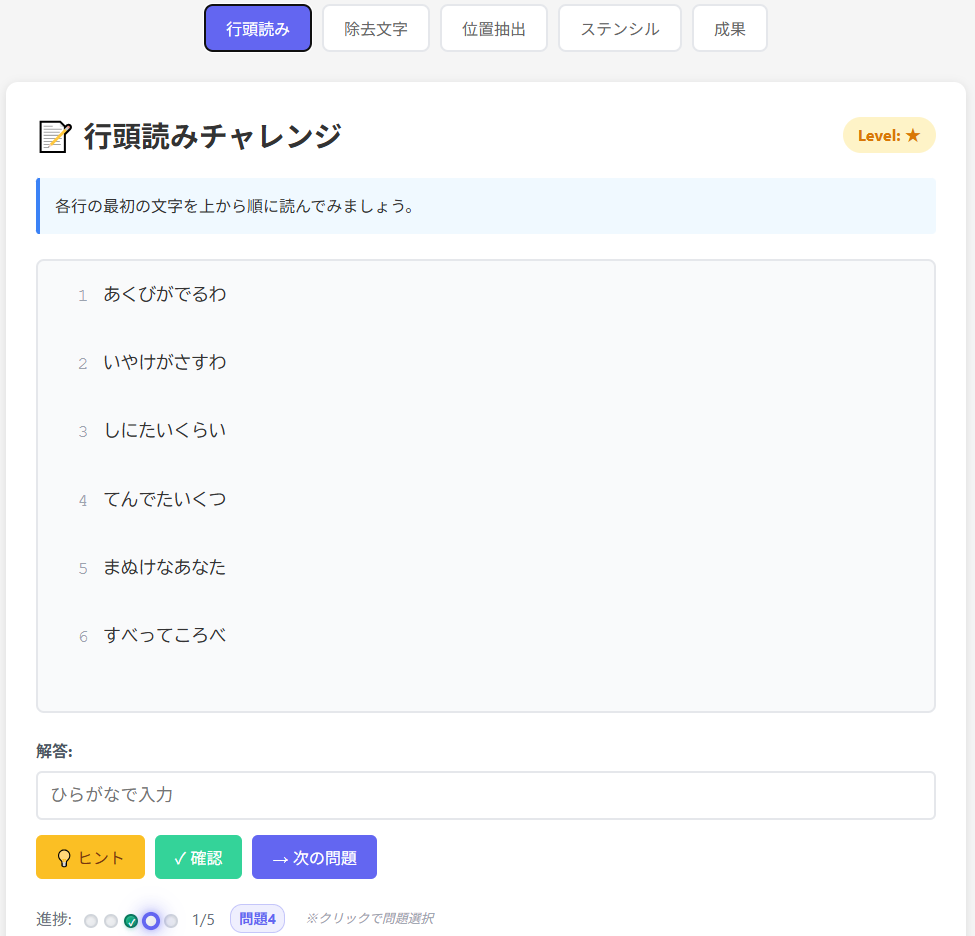

# 🔍 Hidden Message Challenge - 分置式暗号文解読チャレンジツール


[](https://ipusiron.github.io/hidden-message-challenge/)

---

**Hidden Message Challenge** は、分置式暗号の仕組みを楽しく学べるチャレンジ型Webツールです。

文章に巧妙に隠された「本当のメッセージ」を見破る力を養いましょう！

---

## 🔗 デモページ

👉 [https://ipusiron.github.io/hidden-message-challenge/](https://ipusiron.github.io/hidden-message-challenge/)

---

## 📸 スクリーンショット

> 
>
> *行頭読みチャレンジ中*

---

## 🎯 このツールでできること

- **4つの分置式暗号方式**による実践チャレンジ問題（各5問、計20問）
- **インタラクティブなUI**：問題選択、ヒント表示、リアルタイム進捗管理
- **視覚的フィードバック**：正解・不正解・未回答の状態を色分け表示
- **ステンシル暗号の実体験**：実際の型紙操作（移動・回転）による解読
- **総合成果表示**：レーダーチャート、スコア集計、ランク判定機能
- **学習支援機能**：段階的ヒント、問題間の自由な移動、詳細ヘルプ

---

## 🧠 分置式暗号（Concealment Cipher）とは？

<ruby>分置<rt>ぶんち</rt></ruby>は **「分けて置くこと」** を意味し、**分置式暗号（concealment cipher）** とは、伝えたい言葉の間に別の置いて分けることで、元の言葉がわからないように暗号化方式です。

結果的に平文をカムフラージュ用の文章中に分散して配置することになります。
そのため、工夫することで、分置式暗号文は通常の暗号文のように見えず、一見すると意味のある自然な文章や、意味不明だが不自然ではない<ruby>偽文<rt>ぎぶん</rt></ruby>になります。
つまり、「見えなくする」ことを目的とする**ステガノグラフィー（情報隠蔽技術）**の一種とも見なせます。

---

## 🔎 特徴と目的

- 数学的処理や複雑な鍵を必要としない
- 多くの方式が **簡単なルールに基づく**
  - 平文に冗字（無意味な文字）を挿入する仕組みである、挿入法（insertion）が採用されている。そのため、null cipherとも呼ばれる。
  - ただし復号時に冗字を取り除くルールが必要。
- 書籍、日記、絵、文字列など、さまざまな媒体に応用可能

---

## 🧩 分置式暗号の代表的な方式

| 種類 | 概要 | 備考 |
|------|------|------|
| **位置抽出型** | 特定の位置を拾って読む | 歴史的な実例多数。 |
| **除去文字型** | 指定された文字を除くことで平文が現れる | ヒントのキーワードやイラストを暗号文の脇に描いておく |
| **ステンシル型（グリル型）** | 穴の空いた型紙を重ねて、見える部分を読む | 回転グリル暗号や砂時計暗号に応用 |

### 📍 位置抽出型

- 行頭を順に読む。
  - **アクロスティック**とも呼ばれ、古今東西で使われている。「先頭で使われている文字」をつなげていくと、別の単語が浮き出てくる。
- 句読点の3文字後を読む。
- 文頭を順に読み、さらに文末を順（あるいは逆順）に読む
  - <ruby>沓冠<rt>くつかむり</rt></ruby>は、和歌や俳句の<ruby>折句<rt>おりく</rt></ruby>のひとつで、ある語句を各句の初めと終わりに一音ずつ詠み込むもの。

### 🧹 除去文字型

- 「狸（たぬき）」⇒「た」を抜く。
- 「とりい」⇒「い」を取る。
- 「けしごむ」⇒「ご」と「む」を消す。
- 「けむし」⇒「け」を無視。
- 「ちりとり」⇒「ち」と「り」を取る。
- 「虫眼鏡」⇒「め」「が」「ね」を無視。
- 「テントウムシ」⇒「て」「ん」「と」「う」を無視。
- 一人で読んでね⇒「ひとり」⇒「ひ」を取る。

### 🎭 ステンシル型

- ステンシル（格子窓）を重ねて、その窓のところに通信文を書き、白紙の余白を偽文で埋める方法。
- 砂時計型の切り抜きを利用。クリントンの砂時計暗号として知られる。

---

## 📜 歴史的背景・実例

- **ピューリタン革命**や**スパイ戦**などで、文章中に情報を隠す手法が使われていた。
- **トレヴァニアンの小説**や、**一部の戦時通信文**でもこの技法が登場した。
- **回転グリル暗号**は、視覚的な型紙を用いる点で分置式的要素を持つが、構造上は転置式暗号に近い。
- 現代では、SNSの文章や画像キャプションなどに隠す**ソーシャルステガノグラフィー**的応用もある。

---

## 🛡️ 「気づかせない」ことが最大の防御

分置式暗号文は見つけた敵は、それが暗号文であるという事実に即気づいてしまいます（解読できるかどうかは別として）。

一見して暗号文であることをわからなくすれば、安全性が高まります。
その1つのアプローチとして、何気ない文章の中に暗号文を埋め込むという方法があります。
この方法を分置式暗号に適用するには、適当な文字を冗字とするのではなく、全体的に通常の文章や手紙と変わらないよう工夫して文字を選びます。
この方法は、行頭読み型（位置抽出法型の行頭バージョン）やステンシル型で採用できます。

しかし平文が長くなると、全体的に自然な文章にすることは難しくなっていきます。
また、暗号化に手間がかかるという問題もあります。

### 🧪 現代暗号との接点

分置式暗号は、現代の暗号学では**セキュリティ強度が低い**とされますが、その代わりに**気づかれずに伝えること（秘匿性）に特化した教育的・心理的効果**があります。

現代の「**混ぜ物とふるい分け**」のような手法は、分置式暗号の進化系ともいえるでしょう。

---

## 🗝️ 本ツールで体験できること

- 各方式ごとの**ルールとヒント**を読みながら解読に挑戦
- 「読み取れるか？」「気づけるか？」という**気づき型スキル**の訓練
- 「意味がなさそうな文の中に意味がある」逆説的な構造の理解
- ステガノグラフィーの原点とも言える体験

---

## 📌 対象ユーザー

このツールは、以下のような方を対象としています。

- 暗号の仕組みや歴史に興味のある **初心者〜中級者**
- **ステガノグラフィー（情報隠蔽技術）** を学びたい人
- 遊びながら学べる **言葉系パズル** や **チャレンジ型問題** が好きな方
- 学校・セミナー・イベント等での **教育コンテンツ活用** を検討している教育者

技術的な知識は不要で、**直感的な操作で体験可能**です。

---

## 📁 ディレクトリー構成

```
hidden-message-challenge/
├── index.html                    # メインHTMLファイル（5タブUI）
├── css/
│   └── style.css                 # 共通スタイル定義（レスポンシブ対応）
├── js/
│   ├── main.js                   # タブ切り替え・全体制御・ヘルプシステム
│   ├── challenges/
│   │   ├── headline.js           # 行頭読みチャレンジ処理
│   │   ├── removeChar.js         # 除去文字型チャレンジ処理
│   │   ├── position.js           # 位置抽出チャレンジ処理
│   │   └── stencil.js            # ステンシル型チャレンジ処理
│   ├── common/
│   │   ├── utils.js              # 共通ユーティリティ関数
│   │   ├── storage.js            # LocalStorage管理
│   │   └── dataLoader.js         # チャレンジデータ読み込み
│   └── results/
│       ├── score.js              # スコア計算・管理
│       ├── chart.js              # レーダーチャート描画
│       └── share.js              # 共有機能（Twitter・画像保存）
├── data/
│   └── challenges.json           # チャレンジ問題データ
├── assets/
│   └── screenshot.png            # スクリーンショット画像  
├── README.md                     # このファイル
├── LICENSE                       # ライセンス情報（MIT）
└── .gitignore                    # Gitで管理しないファイル指定
```

---

## 🧩 実装済み暗号方式

| 方式 | 難易度 | 問題数 | 特徴 |
|------|--------|--------|------|
| **📝 行頭読み** | ★ | 5問 | 各行の最初の文字を読む基本形式 |
| **🧹 除去文字** | ★★ | 5問 | だじゃれヒントから除去文字を推理 |
| **🎯 位置抽出** | ★★ | 5問 | 特定ルールに従った位置の文字を抽出 |
| **🎭 ステンシル** | ★★★ | 5問 | 型紙操作による視覚的解読体験 |

### 🎮 操作機能

- **問題選択**: 進捗ドットクリックで任意の問題にジャンプ
- **段階的ヒント**: 困った時の多段階ヒントシステム
- **状態管理**: 正解・不正解・現在位置の視覚的表示
- **進捗保存**: LocalStorageによる自動進捗保存
- **成果分析**: レーダーチャート・ランク判定・共有機能

---

## ⚙️ 技術仕様

### 🏗️ アーキテクチャ

- **フロントエンド**: Pure HTML5 + CSS3 + ES6 Modules
- **状態管理**: LocalStorage（進捗・スコア・設定）
- **データ形式**: JSON（問題データ・設定）
- **レスポンシブ**: モバイル・タブレット・デスクトップ対応
- **モジュール設計**: 各チャレンジが独立したクラス構造

### 🎨 UI/UX特徴

- **タブ型インターフェイス**: 5つのタブ（4つのチャレンジ + 成果）
- **視覚的フィードバック**: プログレスドット（緑=正解、赤=不正解、青=現在位置）
- **インタラクティブ要素**: ステンシル移動・回転、リアルタイムプレビュー
- **ヘルプシステム**: 包括的な使い方ガイドとモーダル表示
- **共有機能**: Twitter投稿・画像保存・URL共有

### 📊 データ管理

- **問題データ**: `data/challenges.json`に全20問を格納
- **進捗追跡**: 問題別の正解・不正解・現在位置を記録
- **スコア計算**: チャレンジ別正答率とレーダーチャート表示
- **ランク判定**: 総合スコアによるS〜Dランク評価

### 🏆 ランク判定計算式

総合正答率に基づいて以下の基準でランクが決定されます：

| ランク | 正答率 | 称号 |
|--------|--------|------|
| **S** | 95%以上 | 暗号解読マスター |
| **A** | 80%以上 | 暗号解読上級者 |
| **B** | 60%以上 | 暗号解読見習い |
| **C** | 40%以上 | 暗号初心者 |
| **D** | 40%未満 | これから頑張ろう！ |

**計算方法**: 総合正答率 = (全チャレンジの正解問題数 ÷ 全チャレンジの総問題数) × 100

---

## 🔗 関連リソース

### 🛠️ ツール

- [Grille CipherLab](https://github.com/ipusiron/grille-cipherlab)…回転グリル暗号の可視化ツール

---

## 📄 ライセンス

MIT License - 詳細は [LICENSE](LICENSE) をご覧ください。

---

## 🛠 このツールについて

本ツールは、「生成AIで作るセキュリティツール100」プロジェクトの一環として開発されました。 このプロジェクトでは、AIの支援を活用しながら、セキュリティに関連するさまざまなツールを100日間にわたり制作・公開していく取り組みを行っています。

プロジェクトの詳細や他のツールについては、以下のページをご覧ください。

🔗 [https://akademeia.info/?page_id=42163](https://akademeia.info/?page_id=42163)
