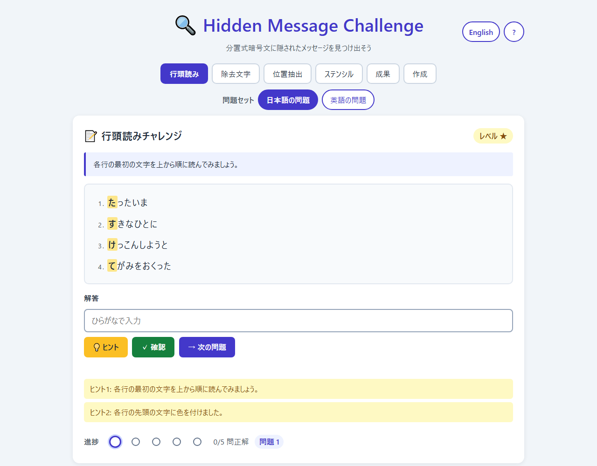
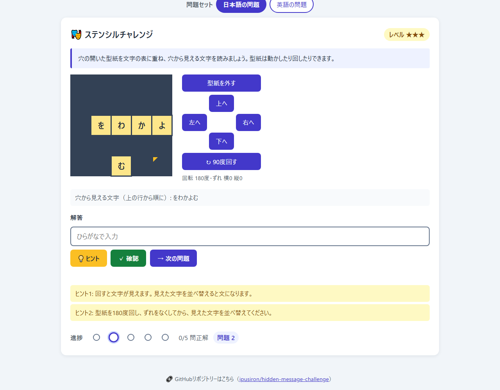
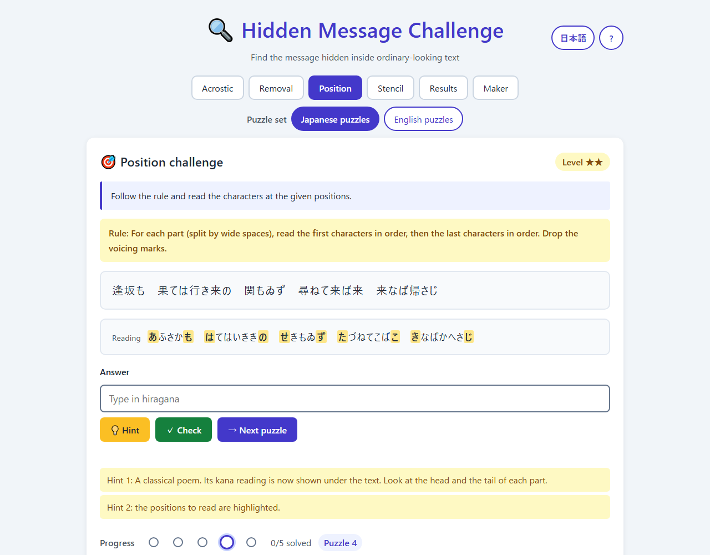

<!--
---
id: day036
slug: hidden-message-challenge

title: "Hidden Message Challenge"

subtitle_ja: "分置式暗号文解読チャレンジツール"
subtitle_en: "Concealment Cipher Decryption Challenge Tool"

description_ja: "分置式暗号の仕組みを楽しく学べるチャレンジ型Webツール。行頭読み・除去文字・位置抽出・ステンシルの4方式で隠されたメッセージを見破るスキルを身につける。"
description_en: "Interactive web tool for learning concealment ciphers. Master 4 cipher techniques—acrostic, character removal, position extraction, and stencil—through 20 progressive challenges."

category_ja:
  - 古典暗号
  - ステガノグラフィー
  - 分置式暗号
category_en:
  - Classical Cryptography
  - Steganography
  - concealment-cipher

difficulty: 2

tags:
  - concealment-cipher
  - steganography
  - acrostic
  - null-cipher
  - stencil
  - puzzle
  - training

repo_url: "https://github.com/ipusiron/hidden-message-challenge"
demo_url: "https://ipusiron.github.io/hidden-message-challenge/"

hub: true
---
-->

# Hidden Message Challenge - 分置式暗号文解読チャレンジツール

[English](README.en.md) · 日本語


[](https://ipusiron.github.io/hidden-message-challenge/)

**Day036 - 生成AIで作るセキュリティツール100**

**Hidden Message Challenge**は、分置式暗号の仕組みを楽しく学べるチャレンジ型Webツールです。

一見すると普通の文章に見えても、実は巧妙に隠された「本当のメッセージ」が潜んでいることがあります。このツールでは、そんな隠されたメッセージを見破る力を段階的に身につけられます。

「行頭読み」「除去文字」「位置抽出」「ステンシル」の**4つの方式**による計20問のチャレンジで、古典的な情報隠蔽の技法を体験できます。
各問題には3段階のヒントがあり、正解すると隠れていた文と解説が表示されます。

進捗はブラウザーに保存され、成果タブではレーダーチャートとランクで「隠されたメッセージを見抜く力」を確かめられます。
現代のサイバーセキュリティにも通じる「気づき」の感覚を、歴史ある暗号技術を通じて養いましょう。

---

## 🔗 デモページ

👉 [https://ipusiron.github.io/hidden-message-challenge/](https://ipusiron.github.io/hidden-message-challenge/)

---

## 📸 スクリーンショット

> 
>
> *行頭読み: ヒント2で各行の先頭に色が付く*

> 
>
> *ステンシル: 型紙を回して重ねると、穴から文字が見える*

> 
>
> *英語表示の位置抽出: 和歌の頭と末尾に言葉を詠み込む「沓冠」*

---

## 🎯 このツールでできること

- **4つの分置式暗号方式**による実践チャレンジ（各5問、計20問）
- **3段階のヒント**: 1つ目は問題ごとの手がかり、2つ目は読む位置の色付け（ステンシルは回す角度）、3つ目は答えの書き出し
- **正解後の解説**: 隠れていた文と、その仕掛けを表示する
- **ステンシルの操作**: 型紙を乗せる・上下左右に動かす・90度ずつ回す。穴から見える文字は文字でも表示する
- **進捗の保存と問題の選択**: 進捗の丸を押すとその問題へ移れる。リロードしても続きから始められる
- **成果の表示**: レーダーチャート、正答数、ランク、Xでの共有、結果の画像保存
- **日英表示**: 画面の言葉を日本語と英語で切り替えられる（問題文は日本語）

---

## 🧠 分置式暗号（Concealment Cipher）とは？

<ruby>分置<rt>ぶんち</rt></ruby>は **「分けて置くこと」** を意味し、**分置式暗号（concealment cipher）** とは、伝えたい言葉の間に別の文字を置いて分けることで、元の言葉がわからないようにする暗号方式です。

結果的に平文をカムフラージュ用の文章中に分散して配置することになります。
そのため、工夫することで、分置式暗号文は通常の暗号文のように見えず、一見すると意味のある自然な文章や、意味不明だが不自然ではない<ruby>偽文<rt>ぎぶん</rt></ruby>になります。
つまり、「見えなくする」ことを目的とする**ステガノグラフィー（情報隠蔽技術）** の一種とも見なせます。

---

## 🔎 特徴と目的

- 数学的処理や複雑な鍵を必要としない
- 多くの方式が**簡単なルールに基づく**
  - 平文に冗字（無意味な文字）を挿入する仕組みである、挿入法（insertion）が採用されている。そのため、Null暗号（null cipher）とも呼ばれる
  - ただし復号時に冗字を取り除くルールが必要
- 書籍、日記、絵、文字列など、さまざまな媒体に応用可能

---

## 🧩 分置式暗号の代表的な方式

| 種類 | 概要 | 備考 |
|------|------|------|
| **位置抽出型** | 特定の位置を拾って読む | 歴史的な実例が多い |
| **除去文字型** | 指定された文字を除くことで平文が現れる | ヒントのキーワードやイラストを暗号文の脇に描いておく |
| **ステンシル型（グリル型）** | 穴の空いた型紙を重ねて、見える部分を読む | 回転グリル暗号や砂時計暗号に応用 |

### 📍 位置抽出型

- 行頭を順に読む
  - **アクロスティック**とも呼ばれ、古今東西で使われている。「先頭で使われている文字」をつなげていくと、別の単語が浮き出てくる
  - 谷川俊太郎の詩「あくび」は、行頭に「あいしてます」を隠した有名な例である（本ツールの行頭読みの4問目）
- 句読点の3文字後を読む
- 文頭を順に読み、さらに文末を順（あるいは逆順）に読む
  - <ruby>沓冠<rt>くつかむり</rt></ruby>は、和歌や俳句の<ruby>折句<rt>おりく</rt></ruby>のひとつで、ある語句を各句の初めと終わりに一音ずつ詠み込むもの

### 🧹 除去文字型

- 「狸（たぬき）」⇒「た」を抜く
- 「とりい」⇒「い」を取る
- 「けしごむ」⇒「ご」と「む」を消す
- 「けむし」⇒「け」を無視
- 「ちりとり」⇒「ち」と「り」を取る
- 「虫眼鏡」⇒「め」「が」「ね」を無視
- 「テントウムシ」⇒「て」「ん」「と」「う」を無視
- 一人で読んでね⇒「ひとり」⇒「ひ」を取る

### 🎭 ステンシル型

- ステンシル（格子窓）を重ねて、その窓のところに通信文を書き、白紙の余白を偽文で埋める方法
- 砂時計型の切り抜きを利用する方法もあり、クリントンの砂時計暗号として知られる

---

## 📜 歴史的背景・実例

- **ピューリタン革命（イングランド内戦）** のころ、捕らえられた王党派のジョン・トレヴァニオン卿が受け取った手紙には、句読点の3文字後を読むと脱出の手がかりが現れる仕掛けがあったと伝えられている。本ツールの位置抽出の「句読点から数えて3文字目」は、この型である
- スパイ戦や**一部の戦時通信文**でも、文章中に情報を隠す手法が使われていた
- **回転グリル暗号**は、視覚的な型紙を用いる点で分置式的要素を持つが、構造上は転置式暗号に近い
- 現代では、SNSの文章や画像キャプションなどに隠す**ソーシャルステガノグラフィー**的応用もある

---

## 🛡️ 「気づかせない」ことが最大の防御

通常の暗号文を見つけた敵は、それが暗号文であるという事実にすぐ気づいてしまいます（解読できるかどうかは別として）。

一見して暗号文であることをわからなくすれば、安全性が高まります。
その1つのアプローチとして、何気ない文章の中に暗号文を埋め込むという方法があります。
この方法を分置式暗号に適用するには、適当な文字を冗字とするのではなく、全体的に通常の文章や手紙と変わらないよう工夫して文字を選びます。
この方法は、行頭読み型（位置抽出型の行頭バージョン）やステンシル型で採用できます。

しかし平文が長くなると、全体的に自然な文章にすることは難しくなっていきます。
また、暗号化に手間がかかるという問題もあります。

### 🧪 現代暗号との接点

分置式暗号は、現代の暗号学では**セキュリティ強度が低い**とされますが、その代わりに**気づかれずに伝えること（秘匿性）に特化した教育的・心理的効果**があります。

現代の「**混ぜ物とふるい分け**（chaffing and winnowing）」のような手法は、分置式暗号の進化系ともいえるでしょう。

---

## 📖 使い方

1. タブで方式を選ぶ（行頭読み・除去文字・位置抽出・ステンシル）
2. 暗号文を読み、答えをひらがなで入れて「確認」を押す（カタカナ・全角半角・空白の違いは問わない）
3. わからなければ「ヒント」を押す。押すたびに次のヒントが出る（3段階）
4. 正解すると、隠れていた文と解説が出る。「次の問題」か進捗の丸で別の問題へ移る
5. 「成果」タブで全体の結果を見る。Xでの共有、画像の保存、最初からのやり直しもここで行う

ファイルを直接開いても（file://）、Webサーバー経由でも動きます。

---

## 📌 対象ユーザー

このツールは、以下のような方を対象としています。

- 暗号の仕組みや歴史に興味のある**初心者〜中級者**
- **ステガノグラフィー（情報隠蔽技術）** を学びたい人
- 遊びながら学べる**言葉系パズル**や**チャレンジ型問題**が好きな方
- 学校・セミナー・イベント等での**教育コンテンツ活用**を検討している教育者

技術的な知識は不要で、**直感的な操作で体験可能**です。

---

## 🎯 活用シナリオ

### 📚 シナリオ1: 教育機関での情報セキュリティ授業

**設定**: 高校の情報科「情報セキュリティ」単元（50分授業）

**実施例**:
- **導入10分**: 分置式暗号の歴史的背景を説明（スパイ通信、戦時中の暗号）
- **体験30分**: 4つのチャレンジをグループ単位で挑戦（2〜3人1組）
- **振り返り10分**: 各グループの成果をレーダーチャートで比較・発表

**教育効果**: 「隠された情報の発見」体験を通じて、現代のフィッシング詐欺やソーシャルエンジニアリングに対する**気づき力**を養う

### 🏢 シナリオ2: 企業セキュリティ研修・チームビルディング

**設定**: IT企業の新入社員研修（午後の部・2時間）

**実施例**:
- **アイスブレイク**: チーム対抗戦形式で「行頭読み」から開始
- **スキルアップ**: 段階的に難易度を上げ、チーム内での相談・協力を促進
- **成果共有**: 各チームのランク結果を共有し、優秀チームを表彰

**研修効果**:
- セキュリティにおける **「見落とし」の危険性**を体験的に理解
- チーム内コミュニケーションの促進
- 「小さな違和感に気づく重要性」をゲーム感覚で学習

### 🎮 シナリオ3: 個人学習・趣味としての暗号チャレンジ

**設定**: 暗号・パズル好きの社会人の隙間時間学習

**実施例**:
- **通勤時間**: スマートフォンで1日1〜2問ずつ進行
- **週末まとめ**: 進捗をレーダーチャートで確認、苦手分野を重点的に復習
- **SNS共有**: 結果をXで共有し、暗号愛好家コミュニティと交流

---

## 🔬 仕様と既知解答

4方式の読み取りは`js/hidden-core.js`にまとめてあり、答え合わせ・ヒントの色付け・テストが同じ処理を使います。
ルールの文面も問題データの構造から作るので、ルールの説明と答えが食い違うことはありません。

- **答えの比較**: 全角半角・空白・カタカナとひらがな・大文字小文字・長音符「ー」の違いは問わない。濁点は区別する（古い仮名の読みなど、別の書き方を正解にする場合は問題データに並べる）
- **行頭読み**: 各行の最初の文字。行頭が漢字の行は、その語の読みを問題データに持つ
- **除去文字**: 指定した文字をすべて取り除いた残り
- **位置抽出**: 目印（「。」「、」など）から決まった数だけ前後の文字、または全角の空白で区切った部分の先頭と末尾の文字
- **ステンシル**: 型紙を時計回りに90度ずつ回し、上下左右にずらしたとき、穴の下にある文字を上の行から順に読む。並べ替え（アナグラム）が必要な問題は、見えた文字と答えの文字が同じかをテストで確かめる

以前の版の誤りと訂正:

- 位置抽出の2つ目のヒントを押すと、暗号文が消えていた（ルールの文面が変わり、ハイライト処理のどの分岐にも当たらなかった）
- リロードすると各チャレンジの進捗表示が0に戻っていた（成果タブだけは保存された値を表示し、表示が食い違っていた）
- 問題データ: 除去文字の5問目は「い」が1つ足りなかった。位置抽出の3問目は「2文字後」とあったが、答えは3文字目だった。ステンシルの2問目は穴が1つ多かった。ステンシルの3問目はヒントが「上から順に読む」だったが、回して並べ替える問題だった

### 問題と既知解答

`js/hidden-data.js`の20問を`js/hidden-core.js`で読んだ結果です。「読み取った文字」が解答の1つ目と一致すること（アナグラムの問題は文字がそろうこと）を、テストで確かめています。

| 問題 | 方式 | やり方 | 読み取った文字 | 解答（正解にする書き方） |
| --- | --- | --- | --- | --- |
| `h1` | 行頭読み | 行頭 | `たすけて` | `たすけて` |
| `h2` | 行頭読み | 行頭（漢字は読み） | `さくらははかない` | `さくらははかない` |
| `h3` | 行頭読み | 行頭 | `かきつはた` | `かきつはた` / `かきつばた` |
| `h4` | 行頭読み | 行頭 | `あいしてます` | `あいしてます` |
| `h5` | 行頭読み | 行頭 | `えるしつているか` | `えるしつているか` / `えるしっているか` |
| `r1` | 除去文字 | `け`を除く | `ありがとう` | `ありがとう` |
| `r2` | 除去文字 | `ご`・`む`を除く | `こんにちはよろしい天気` | `こんにちはよろしい天気` / `こんにちはよろしいてんき` |
| `r3` | 除去文字 | `ひ`を除く | `あすさんじにこうえんであおう` | `あすさんじにこうえんであおう` |
| `r4` | 除去文字 | `め`・`が`・`ね`を除く | `おはようございます` | `おはようございます` |
| `r5` | 除去文字 | `て`・`ん`・`と`・`う`を除く | `たのしいいちにちです` | `たのしいいちにちです` |
| `p1` | 位置抽出 | 「。」の直前の文字を読め。 | `たのしい` | `たのしい` |
| `p2` | 位置抽出 | 「、」の直後の文字を読め。 | `だいすき` | `だいすき` |
| `p3` | 位置抽出 | 「、」・「。」から数えて3文字目を読め。 | `げんき` | `げんき` |
| `p4` | 位置抽出 | 区切り（全角の空白）ごとに、先頭の文字を順に読み、次に末尾の文字を順に読め。濁点は取る。 | `あはせたきものすこし` | `あはせたきものすこし` |
| `p5` | 位置抽出 | 区切り（全角の空白）ごとに、末尾の文字を順に読め。 | `とかなくてしす` | `とかなくてしす` / `とがなくてしす` |
| `s1` | ステンシル | 回さずに重ねる | `さかなつり` | `さかなつり` |
| `s2` | ステンシル | 180度回して並べ替え | `をわかよむ` | `わかをよむ` |
| `s3` | ステンシル | 270度回して並べ替え | `さむゆふい` | `さむいふゆ` |
| `s4` | ステンシル | 270度回す | `きょうあした` | `きょうあした` |
| `s5` | ステンシル | 180度回して並べ替え | `うけこすつと` | `すとけっこう` |

### 引用している作品

行頭読みの2問は、次の作品から引用しています。画面では問題文の下に出典を表示します。

- 行頭読みの4問目: 谷川俊太郎「あくび」
- 行頭読みの5問目: 大場つぐみ・小畑健『DEATH NOTE』（集英社）

### ランクの基準

総合正答率（全20問のうち正解した問題の割合）で決まります。

| ランク | 総合正答率 | 称号 |
| --- | --- | --- |
| **S** | 95%以上 | 暗号解読マスター |
| **A** | 80%以上 | 暗号解読上級者 |
| **B** | 60%以上 | 暗号解読見習い |
| **C** | 40%以上 | 暗号初心者 |
| **D** | 40%未満 | これから頑張ろう |

---

## 🔒 このツールのセキュリティ

- 外部への通信はしない（CSPの`default-src 'none'`）。答え合わせもブラウザーの中で行う
- CSPは`script-src 'self'`・`style-src 'self'`で、インラインのスクリプトとスタイルを使わない
- 表示はDOMの`textContent`で組み立て、HTMLとして解釈しない
- localStorageに保存するのは進捗と表示言語だけ（壊れた値は読み捨て、使えない環境でも動く）
- 答えは問題データに平文で入っている。自習用の教材なので、開発者ツールで見えることは許容している

---

## 🧪 テスト

```bash
npm test
```

- Node.js 22以上。依存パッケージはない（`node --test`）
- GitHub Actionsで、pushとpull_requestのたびに実行する
- `test/core.test.js`: 答えの比較、濁点、アナグラム、4方式の読み取り、型紙の回転とずらし、ランク
- `test/data.test.js`: 20問すべてが規則から答えを導けること、直したデータの誤りが戻らないこと
- `test/progress.test.js`: 進捗の保存形式、壊れた値の扱い、正解・不正解の記録、集計
- `test/html.test.js`: CSP・ARIA・禁止する書き方（innerHTML・インラインのハンドラー・ES moduleなど）
- `test/i18n.test.js`: 日英の辞書のキーの一致、英語に日本語が残らないこと、全問のヒントと解説
- `test/contrast.test.js`: 配色のコントラスト比
- `test/format.test.js`: 行の長さと行数
- `test/readme.test.js`: このREADMEとREADME.en.mdの表の値、構成、画像

---

## 📁 ディレクトリー構造

```
hidden-message-challenge/
├── .github/                # GitHub の設定
│   └── workflows/          # GitHub Actions のワークフロー
│       └── test.yml        # push と pull_request で npm test を実行する
├── assets/                 # 画像
│   ├── en/                 # 英語の画面のスクリーンショット
│   │   └── screenshot.png  # 英語の位置抽出（沓冠）
│   ├── screenshot.png      # 行頭読みのヒント2
│   └── screenshot2.png     # ステンシルを回して重ねた画面
├── css/                    # スタイル
│   └── style.css           # 画面のスタイル（配色は :root の変数）
├── js/                     # スクリプト（classic script）
│   ├── challenges.js       # 4つのチャレンジの画面（共通の流れと方式ごとの描画）
│   ├── hidden-core.js      # 4方式の読み取りと答えの比較（DOM を使わない）
│   ├── hidden-data.js      # 20問のデータ
│   ├── i18n.js             # 日英の辞書・ヒント・解説と言語の切り替え
│   ├── main.js             # 進捗の保存・タブ・ヘルプ・言語の切り替え
│   ├── progress.js         # 進捗の形式と集計（DOM を使わない）
│   └── results.js          # 成果タブ（レーダーチャート・共有・画像保存・リセット）
├── test/                   # 自動テスト（node --test）
│   ├── contrast.test.js    # 配色のコントラスト比
│   ├── core.test.js        # 読み取りと答えの比較
│   ├── data.test.js        # 20問の答えが規則から導けること
│   ├── format.test.js      # 行の長さと行数
│   ├── html.test.js        # CSP・ARIA・禁止する書き方
│   ├── i18n.test.js        # 日英の辞書
│   ├── progress.test.js    # 進捗の保存と集計
│   └── readme.test.js      # README の表・構成・画像
├── .gitignore              # Git の管理から外すファイル
├── .nojekyll               # GitHub Pages で Jekyll を使わない
├── CLAUDE.md               # Claude Code 向けの説明（英語）
├── LICENSE                 # MIT ライセンス
├── README.en.md            # 英語の説明
├── README.md               # 日本語の説明
├── TECHNICAL_NOTES.md      # 技術メモ
├── index.html              # 5タブの画面
└── package.json            # npm test の設定（依存なし）
```

---

## 🔗 関連リソース

- [TECHNICAL_NOTES.md](TECHNICAL_NOTES.md) - 読み取りの処理・型紙のモデル・進捗の保存形式などの技術メモ
- [Grille CipherLab](https://github.com/ipusiron/grille-cipherlab) - 回転グリル暗号の可視化ツール

---

## 💻 動作環境

- Chrome・Edge・Firefox・Safariの最近の版
- ファイルを直接開いても（file://）、Webサーバー経由でも動く
- 幅320pxのスマートフォンから表示できる

---

## 📄 ライセンス

MIT License - 詳細は[LICENSE](LICENSE)をご覧ください。

---

## 🛠 このツールについて

本ツールは、「生成AIで作るセキュリティツール100」プロジェクトの一環として開発されました。 このプロジェクトでは、AIの支援を活用しながら、セキュリティに関連するさまざまなツールを100日間にわたり制作・公開していく取り組みを行っています。

プロジェクトの詳細や他のツールについては、以下のページをご覧ください。

🔗 [https://akademeia.info/?page_id=42163](https://akademeia.info/?page_id=42163)
